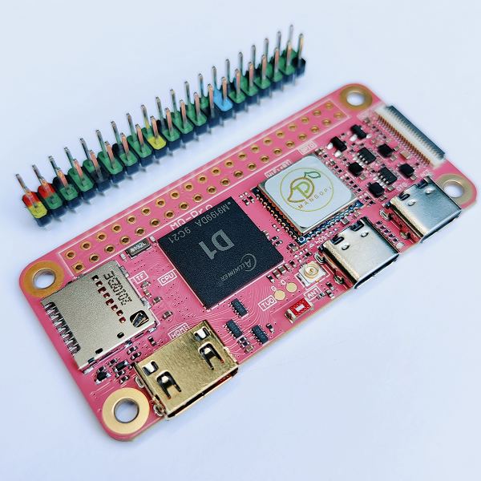

# MangoPi MQ Pro Support

[](https://circleci.com/gh/nerves-project/nerves_system_mangopi_mq_pro)
[](https://hex.pm/packages/nerves_system_mangopi_mq_pro)

This is the base Nerves System configuration for the [MangoPi MQ Pro](#mangopi).

*The MangoPi MQ Pro works well, but there are active updates upstream and here. Backwards incompatible changes may be out of our control.*


<br><sup>[Image credit](#mangopi)</sup>

| Feature              | Description                     |
| -------------------- | ------------------------------- |
| CPU                  | 1 GHz 64 bit RISC-V             |
| Memory               | 512 MB or 1 GB DRAM             |
| Storage              | MicroSD                         |
| Linux kernel         | 6.1 w/ patches                  |
| IEx terminal         | UART `ttyS0`                    |
| GPIO, I2C, SPI       | Yes - [Elixir Circuits](https://github.com/elixir-circuits) |
| Display              | Yes, but not supported yet      |
| ADC                  | No                              |
| PWM                  | 8 channels (4 exposed), but no Elixir support      |
| UART                 | ttyS0                           |
| Camera               | Yes, but not supported yet      |
| Ethernet             | No                              |
| WiFi                 | Onboard WiFi                    |
| RTC                  | No                              |
| HW Watchdog          | Yes                             |

## Using

The most common way of using this Nerves System is create a project with `mix
nerves.new` and add `mangopi_mq_pro` references where needed and in a similar way
to the default systems like `bbb`, etc. Then export `MIX_TARGET=mangopi_mq_pro`.
See the [Getting started
guide](https://hexdocs.pm/nerves/getting-started.html#creating-a-new-nerves-app)
for more information.

If you need custom modifications to this system for your device, clone this
repository and update as described in [Making custom
systems](https://hexdocs.pm/nerves/customizing-systems.html).

## Example use

This example assumes some familiarity with Nerves. To use this system, you'll
need OTP 25. Follow the [Nerves installation
instructions](https://github.com/nerves-project/nerves/blob/main/docs/Installation.md)
for additional system dependencies.

Creating a new hello world application:

```sh
mix nerves.new hello_mango
cd hello_mango
```

Open up your `mix.exs` and add `:mangopi_mq_pro` to the `@all_targets` list at
the top. It's ok to delete targets that you don't plan on using.

Then add the `:nerves_system_mango_mq_pro` dependency to the `deps` function:

```elixir
    {:nerves_system_mangopi_mq_pro, "~> 0.1", runtime: false, targets: :mangopi_mq_pro},
```

This will load the latest released version. To use the latest code on the `main`
branch here, add the following line:

```elixir
    {:nerves_system_mangopi_mq_pro, runtime: false, targets: :mangopi_mq_pro, nerves: [compile: true], git: "https://github.com/nerves-project/nerves_system_mangopi_mq_pro", branch: "main"}
```

To build and write to a MicroSD card, run:

```sh
export MIX_TARGET=mangopi_mq_pro
mix deps.get
mix firmware
mix burn
```

## Console access

The console is configured to output to the UART on pins 8 and 10 on the 40-pin
GPIO connector. This is just like the Raspberry Pi. A 3.3V FTDI cable is needed
to access the output.

## Networking

The board has two network interfaces, a WiFi module and a virtual Ethernet on
the USB C connector marked "OTG". If virtual Ethernet isn't working for you, try
a different USB cable. You're welcome.

## GPIO

The following table is a mapping between the logical GPIO numbers used in
software (sysfs, Circuits.GPIO), and the pin numbers on the 20x2 Raspberry Pi
header. For example, to control pin 11 you would open a connection to GPIO 117.

```elixir
{:ok, pin} = Circuits.GPIO.open(117, :output)
```

The comments in the "Note" columns come from the [official schematic](https://mangopi.org/_media/mq-pro-sch-v12.pdf#page=3).

| GPIO | Note | Pin | Pin | Note | GPIO |
| :--: | :--: | :-: | :-: | :--: | :--: |
|      | 3v3  |  1  |  2  | Vin  |      |
| 205  | SDA  |  3  | 4   | Vin  |      |
| 204  | SCL  |  5  | 6   | GND  |      |
| 39   | MCLK |  7  | 8   | TX0  | 40   |
|      | GND  |  9  | 10  | RX0  | 41   |
| 117  | TX1  | 11  | 12  | I2S_CLK / PWM0 / Audio | 37   |
| 118  | RX1  | 13  | 14  | GND  |      |
| 32   | PWM3 | 15  | 16  | PWM4 | 33   |
|      | 3v3  | 17  | 18  | DC   | 110  |
|      | MOSI | 19  | 20  | GND  |      |
|      | MISO | 21  | 22  | RX2  | 65   |
|      | SCLK | 23  | 24  | CS0  |      |
|      | GND  | 25  | 26  | CS1  | 111  |
| 145  | SDA  | 27  | 28  | SCL  | 144  |
| 42   |      | 29  | 30  | GND  |      |
| 43   |      | 31  | 32  | TX2  | 64   |
| 44   |      | 33  | 34  | GND  |      |
| 38   | PWM1 / I2S_FS | 35  | 36  | DI2  | 34   |
| 113  |      | 37  | 38  | I2S_DI0  | 35   |
|      | GND  | 39  | 40  | I2S_D0   | 36   |

You can also get the pinout at the IEx prompt by using the
[pinout](https://hex.pm/packages/pinout) library.

## Pinout diagram


## Schematics and datasheets

* [Schematics](https://mangopi.org/_media/mq-pro-sch-v12.pdf)
* [IBOM](https://mangopi.org/_media/mq-pro-v12-ibom.html) - Interactive web page
  to help you find what part is located where
* [D1 user manual (PDF, 1390 pages)](https://mangopi.org/_media/d1-h_user_manual_v1.0.pdf)

## Thanks

The most helpful Allwinner D1 information comes from
[linux-sunxi.org/Allwinner_Nezha](https://linux-sunxi.org/Allwinner_Nezha). All
of the work here wouldn't have been possible with out it. Thanks especially to
[smaeul's Allwinner D1 Linux fork](https://github.com/smaeul/linux/tree/riscv/d1-wip/arch/riscv)

Here are more useful links:

* [bret.dk's ARMBian post](https://bret.dk/armbian-on-the-mangopi-mq-pro/)
* [NixOS on D1](https://github.com/chuangzhu/nixos-sun20iw1p1)
* [YuzukiHD Buildroot](https://github.com/YuzukiHD/Buildroot-YuzukiSBC)
* [DongshanPI Store](https://www.aliexpress.com/item/3256803971669780.html)

[Image credit](#mangopi): This image is from [mangopi.cc](https://mangopi.cc/mangopi_mqpro).
